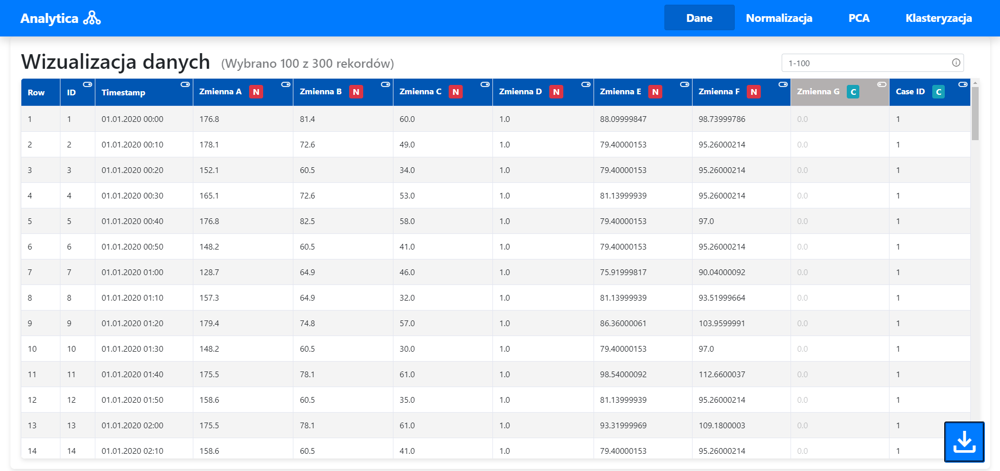
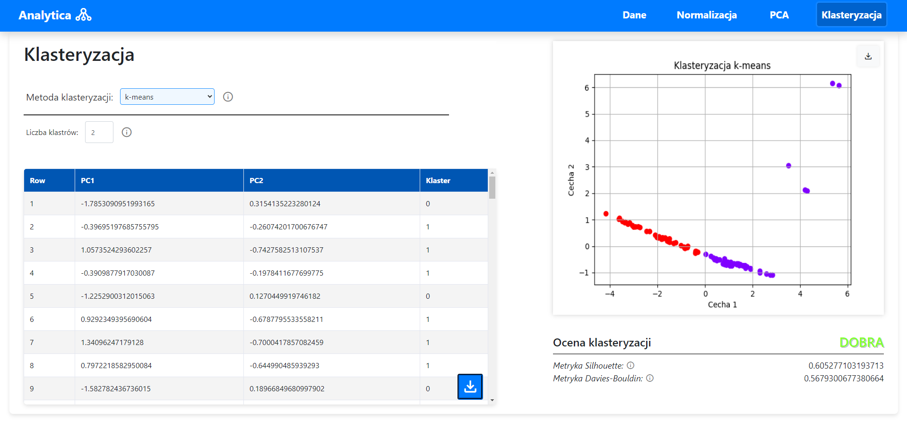

# Analytica
A simple web application for data analysis designed as a main project for Software Engeneering course at AGH University.

## Co-authors:
- Hieronim Koc: https://github.com/Panyloi
- Norbert Żmija: https://github.com/CaffeinatedViper
## Tech stack:
- Frontend: Angular
- Backend: Python + Flask API
 

## Overview
The main purpose of the application is to support the data analysis process, with emphasis on clustering the set.
Therefore, basic tools have been made available in the form of a web interface at every stage leading to data clustering.
The application consists of five main modules that together act as pipeline processing:
### 1. Basic data processing
It allows user to load data as a .csv file and then process the data in the following areas:
- Selection of rows
- Selection of columns (features)
- Change of column (feature) type

### 2. Data normalization
It allows you to perform normalization on previously selected data. Several different methods are provided for normalizing variables.

### 3. PCA
It allows you to perform PCA (Principal Component Analysis) and reduce the dimensionality of data.

### 4. Data clustering
It allows for grouping variables (clustering) based on PCA results. 
Several parameterizable clustering methods are available, as well as automatic assessment of cluster homogeneity.

### 5. Data extraction
It allows you to extract processed data in the form of a .csv file. The processed data can then be used in more advanced forms of data analysis, depending on the user's goals.

 

## Setup and launch
To run application on your PC follow these steps:
1. Go to ***/backend*** directory. Install necessary dependencies from ***requirements.txt*** file: `pip install -r requirements.txt`.  Recommended version of Python: **3.9**.
